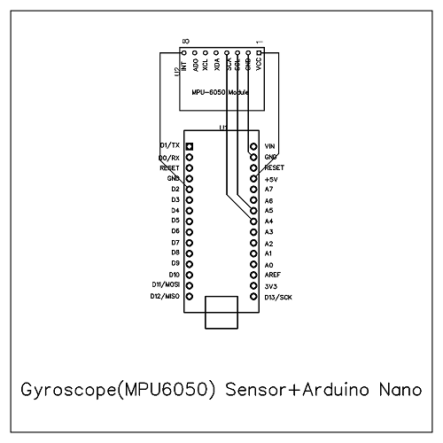
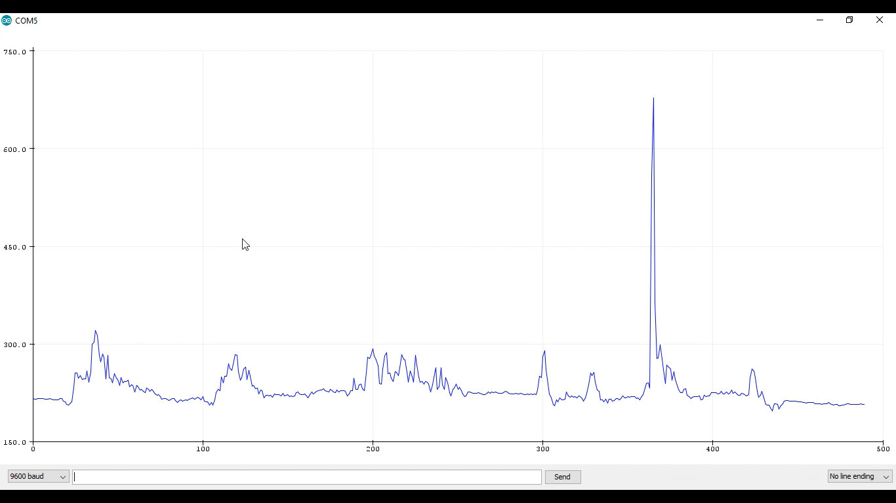

# Human - Machine Interface (HMI)
```bash
.
├── Arduino
│   ├── Arduino-MPU6050-master.zip
│   ├── EMG
│   │   └── EMG.ino
│   └── Gyroscope
|       └── Gyroscope.ino
├── Python
│   ├── EMG.py
|   ├── GUI.py
│   ├── Gyroscope.py
│   └── Keyboard.py
├── images
│   ├── EMG_GPB.jpg
|   ├── EMG_PCB.png
│   ├── Gyroscope_GPB.jpg
│   ├── Gyroscope_Output.png
│   └── Gyroscope_PCB.png
└── README.md
```

# Arduino
    Arduino IDE -> Sketch -> Include Library -> Add .ZIP Library -> Arduino-MPU6050-master.zip
    
# Python
    pip install pyautogui
    pip install pyserial
   Run GUI.py
   
# Hardware
    1. EMG sensor
    2. Gyroscope MPU6050
    3. Arduino Nano
    
# Circuit


# Output 
Gyroscope


EMG

